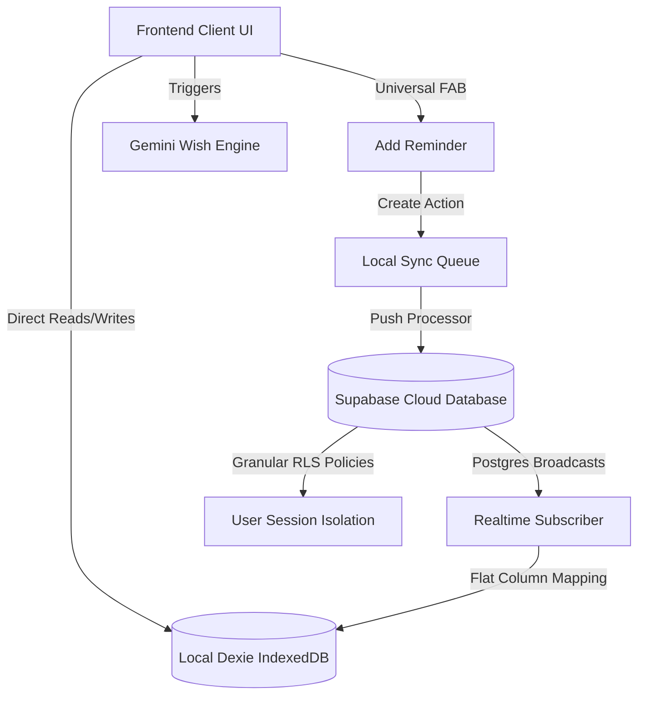

# Occasionly 🎉
### The Premium Relationship Intelligence Operating System

**Occasionly** is an offline-first, bidirectional-sync relationship intelligence engine built to help you track connection milestones, manage memories, and generate hyper-personalized AI wishes securely. Inspired by clean, high-end visual aesthetics (glassmorphism, radial glows, and sleek dark modes), it is engineered for absolute client privacy, reliability, and security.

---

## 🏗️ System Architecture

Occasionly utilizes a decoupled, local-first offline architecture:



### Key Architectural Pillars:
1. **Offline-First Indexing (Dexie.js)**: Local connection metadata, reminder logs, and notifications are written directly to IndexedDB.
2. **Local Sync Queue**: Modifications made while offline are staged in a queue and automatically synchronized with the cloud once network connectivity resumes.
3. **Flat Cloud Storage (Supabase)**: High-performance, auditable relational tables secured with individual Row-Level Security (RLS) policies for `SELECT`, `INSERT`, `UPDATE`, and `DELETE` queries, mapped via `auth.uid() = user_id`.
4. **Structured Diagnostics (Diagnostic Logger)**: Lightweight logging of sync, AI, backup, and realtime channel exceptions persisted inside the browser's `localStorage` for live production diagnostics.

---

## 🛠️ Technology Stack

- **Core**: Next.js 16 (Webpack bundler), React 19, TypeScript
- **Styling**: Tailwind CSS, Framer Motion (premium animations)
- **Local DB**: Dexie.js (IndexedDB wrapper)
- **Database & Auth**: Supabase (Cloud database, RLS, Auth)
- **AI Engine**: Google Gemini API (`gemini-1.5-flash`)
- **PWA Asset Suite**: Service workers and standalone manifest support for mobile touch screen installations

---

## 🚀 Setup & Local Execution

### 1. Prerequisite Installations
- Ensure you have [Node.js](https://nodejs.org/) (v20+ recommended) and Git installed.
- Supabase CLI installed locally:
  ```bash
  npm install -D supabase
  ```

### 2. Environment Variables Configuration
Create a `.env.local` file in the root directory:
```env
NEXT_PUBLIC_SUPABASE_URL=your_supabase_project_url
NEXT_PUBLIC_SUPABASE_ANON_KEY=your_supabase_anon_api_key
NEXT_PUBLIC_GEMINI_API_KEY=your_gemini_api_key
```

### 3. Apply Cloud Database Migrations
Push local schemas and RLS policies into your remote Supabase instance:
```bash
npx supabase db push
```

### 4. Launch Local Development Server
```bash
npm run dev
```
Open **[http://localhost:3000](http://localhost:3000)** in your browser.

---

## 🛡️ Row-Level Security (RLS) Rules

Database access is protected on all tables:
- `events` table flat columns: `id`, `user_id`, `person_name`, `occasion_type`, `occasion_date`, `reminder_days_before`, `reminder_time`, `timezone`, `relationship_type`, `nickname`, `interests`, `gift_ideas`, `notes`, `created_at`, `updated_at`, `version`.
- Granular Policies:
  - **SELECT**: `auth.uid() = user_id`
  - **INSERT**: `with check (auth.uid() = user_id)`
  - **UPDATE**: `auth.uid() = user_id`
  - **DELETE**: `auth.uid() = user_id`

---

## 🌿 Engineering Git Branching Workflow

To maintain version control safety and clean release cycles, we adhere strictly to the following branching topology:

### Branch Roles
- `main` ── **Stable Production Branch**: Home to compiled, production-ready releases. No direct edits are made here.
- `feature/*` ── **Active Development Branches**: Each feature or refactor is worked on in an isolated branch.

### Creating a New Feature
1. Checkout to the stable main branch:
   ```bash
   git checkout main
   ```
2. Pull latest upstream commits:
   ```bash
   git pull origin main
   ```
3. Spawn a clean feature branch:
   ```bash
   git checkout -b feature/your-feature-name
   ```
4. Commit often, push frequently, and open a PR into `main` after verification.

---

## 📦 Cloud Staging & Deployments (Vercel)

Occasionly utilizes a **Local ➔ Preview ➔ Production** pipeline:
1. Every commit pushed to GitHub automatically triggers a **Vercel Preview Deployment**.
2. Staged changes are validated on preview domains on multiple browser dimensions.
3. Upon approval, the release is promoted to **Production** on Vercel's edge network.
