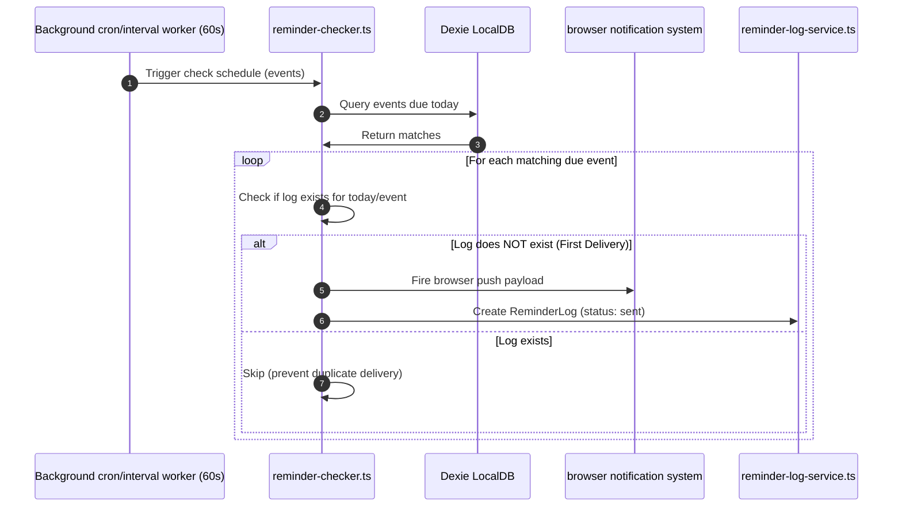

# Notification Check & Delivery Flow Spec

This document details the background cron check system and delivery flow of the **Notification Domain**.

---

## 1. Sequence Flow

---

## 2. Background Checker Interval
- Occasionly runs checks every **60 seconds** in the background.
- It matches local browser timezone coordinates against `reminderTime` and `reminderOffsetDays` configurations.

---

## 3. Duplicate Delivery Protections
To guarantee that a user never receives duplicate notifications for the same event:
1. Every successful delivery creates a `ReminderLog` entry in local storage.
2. The primary key combines `eventId` + `year` + `offsetDay`.
3. The cron loop query filters out events where a matching primary key is already logged, guaranteeing single delivery outcomes even across browser reloads.
