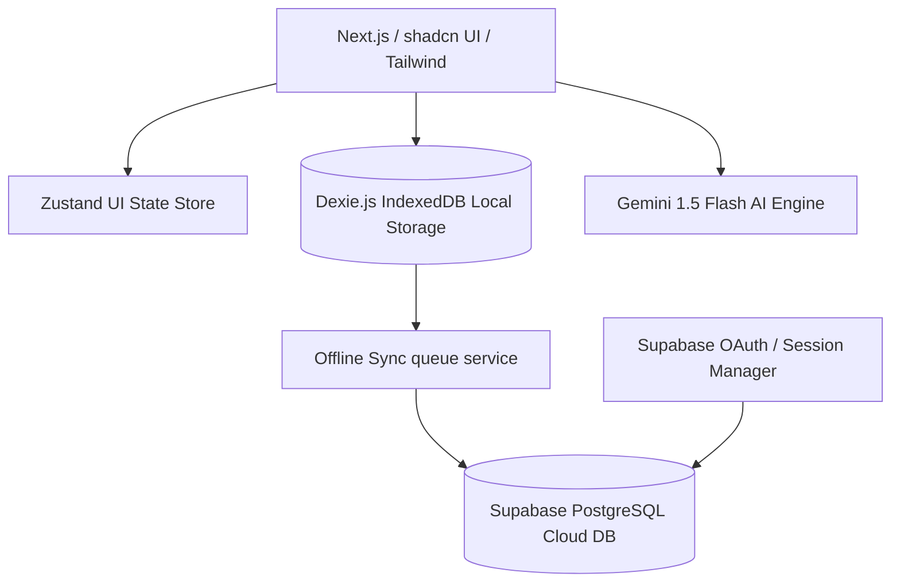
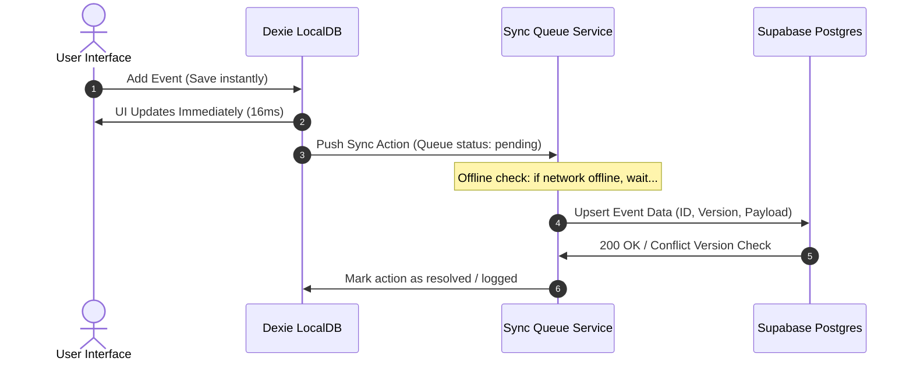

# System Architecture Plan — Occasionly Relationship OS

This document outlines the technical blueprint and structural composition of **Occasionly**. 

---

## 1. High-Level System Diagram



---

## 2. Technical Stack Specifications

### 2.1 Frontend Framework
- **Core Engine**: Next.js (App Router, Static Prerendering).
- **Type Safety**: TypeScript 5+ (No implicit any, strict null checks).
- **Styling & Design**: Tailwind CSS, Class Variance Authority (`cva`), and custom vanilla tokens.
- **Interactions**: Framer Motion (spring-based layout physics).
- **State Management**: Zustand (UI sidebar, settings modal, and command palette configurations).

### 2.2 Client-Side Storage
- **Database**: IndexedDB mapped via **Dexie.js**.
- **Entities**:
  * `events`: Stores the OccasionEvents.
  * `reminderLogs`: Tracks the reminder deliveries and statuses.
  * `conflicts`: Traceable conflict logs.

### 2.3 Cloud Infrastructure
- **Serverless Backend**: Supabase BaaS.
- **Auth**: GoTrue OAuth Google + standard email/pass.
- **Database**: PostgreSQL (Managed Row-Level Security, CLI-driven migrations).
- **Realtime Services**: Postgres Changes listening triggers.

---

## 3. Data Synchronization Lifecycle



### 3.1 Conflict Resolution
Occasionly uses the robust **Last-Write-Wins (LWW)** strategy:
- Each event row maintains an incremental `version` counter and a `updatedAt` ISO string.
- During pull and sync operations, if `cloudVersion > localVersion`, the local record is updated and a `ConflictLog` is created in Dexie.
- If versions match, the latest `updatedAt` takes precedence.

---

## 4. Directory & Folder Structure

```txt
src/
├── app/                  # Next.js Page components & API routes
├── components/           # Reusable UI widgets
│   ├── dashboard/        # Centerpiece elements (Featured, Stats, Hero)
│   ├── layout/           # AppShell, Navigation Sidebar, Topbar
│   ├── reminders/        # Grid structures, Card details, Badges
│   └── ui/               # Primitive Atoms (Buttons, Modal dialogs, optgroups)
├── constants/            # occasionMeta constants & Category mappings
├── hooks/                # Sync coordination hooks
├── lib/                  # Database, schema definitions, and validation logic
├── services/             # API services (Gemini AI, Supabase API client)
├── store/                # Zustand globally exposed state managers
└── types/                # Strict Type definitions & Interfaces
```

---

## 5. Security & Availability Philosophy
- **Row-Level Security (RLS)**: Mandatory PostgreSQL rule on `events` table:
  `alter table public.events enable row level security;`
  `create policy "Allow owners read/write access" on public.events ...`
- **Graceful Failure**: If the cloud database is paused, the sync hooks swallow errors silently, maintaining local operations fully in IndexedDB.
- **AI Rate Limits**: API routes include simple edge bounds to protect Gemini execution volumes.
