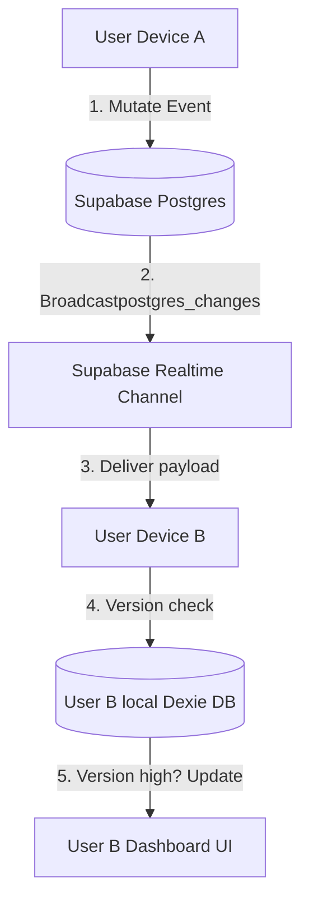

# Realtime Broadcast Flow Spec

This document describes how **Supabase Realtime Postgres Changes** subscriptions are leveraged to coordinate multi-device sessions.

---

## 1. Flow Diagram

---

## 2. Subscription Reconciliation Rules
To prevent loops and circular writes when receiving a broadcast update:
1. Extract event payload from `payload.new`.
2. Check if event already exists in local **Dexie IndexedDB**:
   - *Case A (No local copy)*: Add record to local DB immediately. Rerender UI.
   - *Case B (Local version < Broadcast version)*: Apply broadcast updates to local DB. Write log, refresh UI.
   - *Case C (Local version >= Broadcast version)*: Discard update (local edit is more recent or in sync).
3. Under no circumstances may a broadcast-triggered local update push a *new* action to the sync queue (prevents circular loops).
