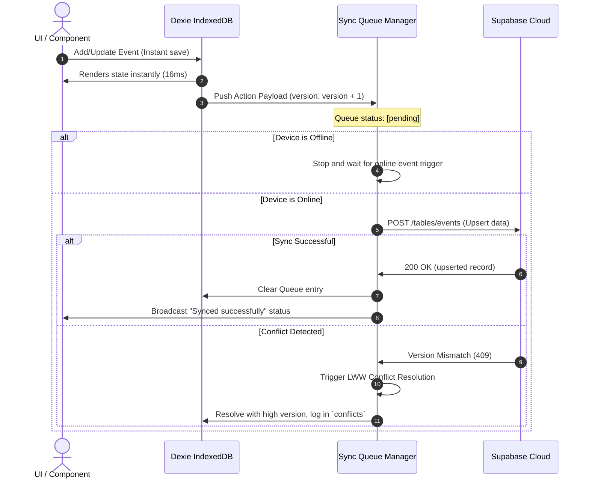

# Synchronization Lifecycle Spec

This document details the sequence flow, offline queuing lifecycle, and conflict resolution rules of the **Sync Domain**.

---

## 1. Sequence Diagram

---

## 2. Sync Queue State Model
The offline sync queue tracks events through four core states:
- **`idle`**: No actions pending. Sync is verified.
- **`pending`**: Action created locally and queued. Waiting for worker trigger.
- **`syncing`**: Network payload is currently flying to Supabase cloud.
- **`error`**: Network timeout, offline state, or server error. Will retry on reconnect.

---

## 3. Conflict Resolution Algorithm (Last-Write-Wins)
When syncing or pulling records from Supabase:
1. Compare `cloud_version` vs `local_version`.
2. If `cloud_version > local_version`:
   - Cloud record is considered authoritative.
   - Local Dexie record is overwritten.
   - A `ConflictLog` is created locally.
3. If `cloud_version < local_version`:
   - Local record is considered authoritative.
   - Sync Queue pushes local state to cloud.
4. If `cloud_version == local_version`:
   - Fall back to the latest `updatedAt` ISO date string.
