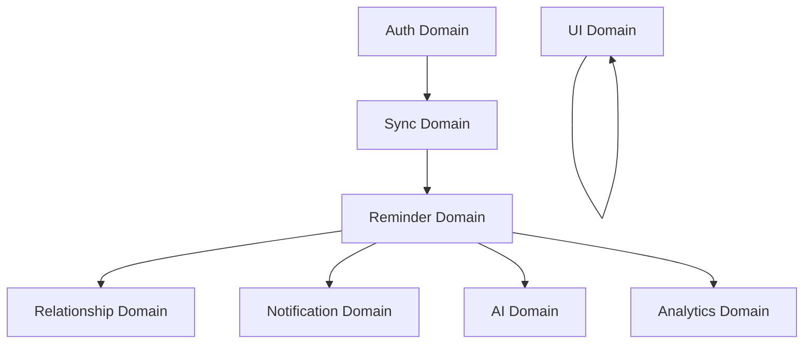

# Bounded Context & Domain Map

This document establishes the architecture boundaries, ownership rules, and dependencies for all sub-domains inside **Occasionly** to prevent architectural sprawl and circular dependencies.

---

## 1. Subsystem Domains Reference Map

---

## 2. Domain Classifications

### 2.1 Reminder Domain
- **Ownership**: `/src/services/reminder-service.ts`, `/src/services/reminder-priority.ts`
- **Responsibilities**: Calculating pre-alerts, offset offsets, recurring dates, counting days remaining, and establishing priorities.
- **Boundaries**: Operates strictly on `OccasionEvent` entities to yield `ReminderItem` lists.
- **Dependencies**: Relationship Domain, Dexie LocalDB.

### 2.2 Relationship Domain
- **Ownership**: `/src/services/event-service.ts`, `/src/types/event.ts`
- **Responsibilities**: Core CRUD operations on connections (events), managing fav markers, interests, nicknames, notes, and occasion configuration categories.
- **Boundaries**: Handles mutations and reads directly on local Dexie data schemas.
- **Dependencies**: None.

### 2.3 Notification Domain
- **Ownership**: `/src/services/notification-service.ts`, `/src/services/reminder-checker.ts`
- **Responsibilities**: Requesting Web Notification approvals, queueing background worker checkers, scheduling deliveries, and tracking logs.
- **Boundaries**: Manages the local device notification queue and app notification entities.
- **Dependencies**: Reminder Domain.

### 2.4 Sync Domain
- **Ownership**: `/src/services/sync-service.ts`, `/src/services/cloud-event-service.ts`, `/src/services/realtime-service.ts`
- **Responsibilities**: Queued offline actions serialization, Supabase synchronization operations, version counter updates, Last-Write-Wins conflict logging, and realtime Postgres changes coordination.
- **Boundaries**: Acts as the gatekeeper between client-side Dexie IndexedDB and server-side Supabase clouds.
- **Dependencies**: Auth Domain, Relationship Domain.

### 2.5 AI Domain
- **Ownership**: `/src/services/ai-service.ts`, `/src/services/ai-prompt-builder.ts`
- **Responsibilities**: Assembling custom Gemini prompts based on occasion configuration maps, contextual milestones (e.g. year metrics), interests, nicknames, and preferred tones.
- **Boundaries**: Interacts strictly with raw prompts and external Gemini Flash API boundaries.
- **Dependencies**: Relationship Domain.

### 2.6 Analytics Domain
- **Ownership**: `/src/services/analytics-service.ts`, `/src/types/analytics.ts`
- **Responsibilities**: Computing connection metrics, categories breakdown counts (personal, career, memory, celebration), upcoming weekly urgency counters, and logs completion rates.
- **Boundaries**: Exposes calculated metrics in the `AnalyticsData` structure to the UI.
- **Dependencies**: Reminder Domain, Notification Domain.

### 2.7 UI Domain
- **Ownership**: `/src/components/*`, `/src/store/ui-store.ts`
- **Responsibilities**: Page rendering, layout shell structures, modal Dialog triggers, Command Palette inputs, micro-animations, color maps, and responsive layout styling.
- **Boundaries**: Consumer interface layer. No direct database mutations or server connections.
- **Dependencies**: All Bounded Service layers, Zustand Store.

### 2.8 Auth Domain
- **Ownership**: `/src/services/auth-service.ts`, `/src/lib/supabase.ts`
- **Responsibilities**: Managing active user sessions, Google OAuth providers, session tokens caching, and local-first session restoration.
- **Boundaries**: Handshakes with standard Supabase GoTrue Auth client libraries.
- **Dependencies**: None.
