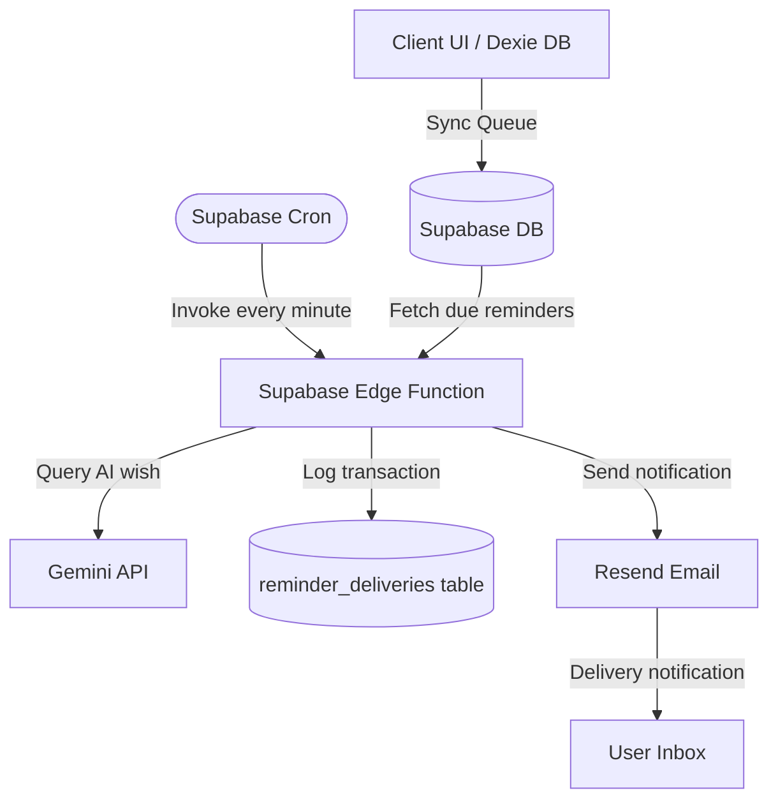

# Reminder Delivery Engine Specification (SDD)

This document specifies the technical design, operations, and lifecycle flow of the Occasionly **Reminder Delivery Engine** (Phase 4).

---

## 🎯 Goal
Build a resilient, offline-first scheduling and notification engine that monitors due milestones, generates tailored AI greetings, records deliveries, and coordinates multi-channel messaging (Email + WhatsApp deep links).

---

## 🔄 Core User Flow
The lifecycle of a single reminder follows this sequential path:
1. **Reminder Created**: User saves a Connection anniversary/birthday milestone locally or while online.
2. **Stored in Supabase**: The event details synchronize to the cloud with calculated `next_reminder_at` dates.
3. **Cron Job Trigger**: A scheduled cron service evaluates active records every minute.
4. **Due Reminders Fetched**: The cron service queries and flags events where `next_reminder_at <= now()`, `reminder_enabled = true`, and no reminders have been sent today.
5. **AI Wish Generation**: The system sends event attributes (notes, preferences, AI tone) to the Gemini model to synthesize a custom wish.
6. **WhatsApp Link Prefill**: A WhatsApp deep-link URL prefilled with the AI wish is assembled.
7. **Email Delivery**: The system triggers a transaction email using Resend to send the notification to the user containing the pre-filled link.
8. **Delivery Logged**: A transaction record is created in the `reminder_deliveries` log tracking the execution.
9. **Marked Delivered**: The event's `last_reminded_at` is set, and `next_reminder_at` is shifted forward to the next recurrence.

---

## 🏛️ System Architecture

---

## 📡 Delivery Channels
1. **Email (Resend)**: Sends the primary alert notifying the user of the milestone, containing the AI wish template and a click-to-open WhatsApp button.
2. **WhatsApp Direct Link**: A formatted `https://wa.me/{phone}?text={message}` hyperlink that opens WhatsApp, targets the contact, and pre-fills the message text.

---

## ⏳ Reminder Lifecycle States
Each delivery log in `reminder_deliveries` maps to one of these states:
- `pending`: Registered and awaiting edge function processing.
- `processing`: Active task execution in progress.
- `delivered`: Notification successfully delivered to the target channel.
- `failed`: Terminal failure encountered (e.g. invalid credentials, missing emails).
- `retrying`: Transient error recovery loop active.

---

## 🔁 Retry Logic & Failure Handling
- **Transient Failures**: Network failures (e.g., Gemini timeouts, Resend endpoint downtime) trigger up to 3 retries spaced with exponential backoffs.
- **Terminal Failures**: Validation failures (e.g., empty phone numbers, disabled email settings) transition immediately to the `failed` state and write details to `error_message`.
- **Duplicate Prevention**: RLS validation policies combined with unique transaction ID constraints prevent double-sending alerts.

---

## 🔒 Security
- All edge function invocations are gated via auth signatures and token header handshakes.
- The `reminder_deliveries` log table implements Row-Level Security policies restricting queries to authenticated owners (`auth.uid() = user_id`).

---

## 🚀 Future Enhancements
- Support for Native Push Notifications (Service Worker Web Push API).
- AI automatic SMS dispatch.
- Multi-recipient custom scheduling channels.
