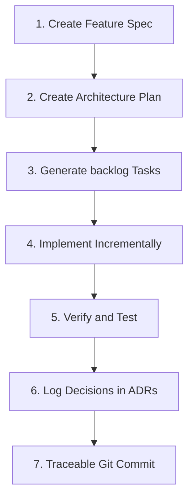

# Spec-Driven Development (SDD) Workflow

This document establishes the official development procedures for writing features and modifications inside the **Occasionly** codebase.

---

## 1. SDD Implementation Cycle

---

## 2. Step-by-Step Execution Guide

### Step 1: Create Feature Spec
- Copy `specs/templates/feature-spec-template.md` to a new markdown file inside `specs/features/`.
- Define functional requirements, non-functional requirements, edge cases, and acceptance thresholds.

### Step 2: Create Architecture Plan
- If the feature introduces schema additions, third-party libraries, or new APIs, document a system plan in `specs/architecture/`.
- Use Mermaid diagrams to model the data sequence flow.

### Step 3: Generate Backlog Tasks
- Create a clear checklist inside the spec file or `task.md` outlining atomic, sequential steps to implement the feature.

### Step 4: Implement Incrementally
- Write code in small, testable slices.
- Do not build large monolithic blocks; test and commit incremental files.

### Step 5: Verify and Test
- Verify all changes locally:
  * Run TypeScript type-checking: `npx.cmd tsc --noEmit`.
  * Run compiler builds: `npm.cmd run build`.
  * Verify layout responsiveness on both mobile and desktop.

### Step 6: Log Decisions in ADRs
- If implementation required trade-offs or modifications to plans, log these choices inside `specs/decisions/` using `specs/templates/adr-template.md`.

### Step 7: Commit with Traceability
- Commit changes using clear, descriptive messages, referencing spec links or requirements to maintain absolute traceability in version control.
- E.g. `feat(reminders): implement progressive dropdown actions (specs/features/reminders-spec.md FR-2)`.
